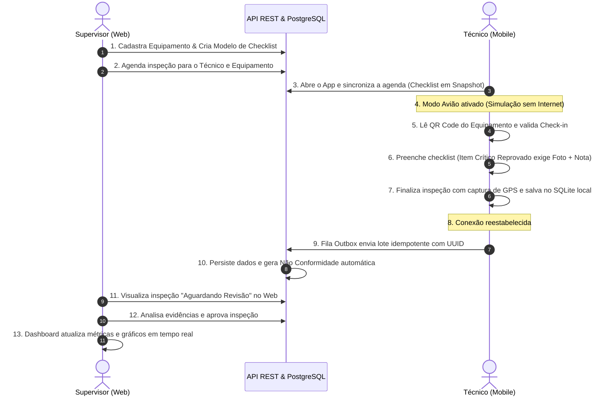

# Planejamento de Entregas para o Fim do Semestre — FieldOps

**Data:** Setembro de 2026  
**Contexto:** Projeto Integrador — 4º Semestre de Análise e Desenvolvimento de Sistemas (SENAI)  
**Projeto:** FieldOps — Plataforma Integrada de Inspeções em Campo (*Offline-First*)  
**Equipe:** Murilo, Pedro, Julio, Matheus, Juan, Gizela  

---

## 1. Visão Geral e Meta da Entrega Final

O objetivo central do projeto até o encerramento do semestre é entregar um **Produto Mínimo Viável (MVP) totalmente integrado e funcional de ponta a ponta**, demonstrando o ciclo operacional completo de uma inspeção técnica:

$$\text{Configuração} \longrightarrow \text{Agendamento} \longrightarrow \text{Execução (Mobile/Offline)} \longrightarrow \text{Sincronização} \longrightarrow \text{Revisão (Web)} \longrightarrow \text{Indicadores}$$

A entrega final será avaliada com base na capacidade da solução de operar de forma consistente, integrada e sem dependência de simulações estáticas no momento da apresentação.

---

## 2. O "Fluxo Dourado" da Apresentação (Happy Path da Banca)

Para garantir a nota máxima na banca avaliadora do SENAI, o sistema deverá executar com perfeição o seguinte roteiro ao vivo:



---

## 3. Matriz de Escopo do Semestre (MoSCoW)

Para evitar atrasos e assegurar a entrega nos prazos letivos, o escopo foi priorizado:

| Categoria | Funcionalidades / Requisitos |
| :--- | :--- |
| **Must Have**<br>*(Obrigatório para o Semestre)* | • **Web:** Dashboard com KPIs reais, Cadastro de Equipamentos, Construtor de Checklists, Agendamento e Tela de Revisão/Aprovação.<br>• **Mobile:** Autenticação de técnico, lista de tarefas, leitura de QR Code para check-in, execução de formulário dinâmico, captura de foto de não conformidade, registro de GPS e fila offline (SQLite).<br>• **Backend & Banco:** PostgreSQL provisionado com 14 tabelas, API REST com rotas autenticadas (JWT), geração de snapshots e processamento idempotente.<br>• **Gestão:** TAP, EAP, Arquitetura, Regras de Negócio e Documento Final do PI atualizados. |
| **Should Have**<br>*(Importante, se houver tempo)* | • Validação de duplicidade na fila Outbox com reenvio automático ao reconectar.<br>• Exportação de relatório da inspeção em PDF no painel Web.<br>• Filtro por severidade das não conformidades no Dashboard.<br>• Script de seed completo com compressores, bombas e usuários de teste. |
| **Could Have**<br>*(Diferenciais / Opcional)* | • Assinatura digital do técnico ou supervisor na tela do mobile.<br>• Modo escuro no painel Web.<br>• Notificações push quando uma inspeção for atribuída ou reprovada. |
| **Won't Have**<br>*(Fora do escopo deste semestre)* | • Integração com sistemas legados de ERP/SAP corporativos.<br>• Rastreamento do técnico em tempo real via mapa ao vivo com telemetria contínua.<br>• Suporte nativo para plataforma iOS (foco total em Android/Web). |

---

## 4. Pacotes de Trabalho e Entregáveis por Frente

### 4.1. Frente de Dados & Infraestrutura
* **Banco Central:** PostgreSQL provisionado em ambiente local via Docker Compose (ou banco hospedado em nuvem para facilidade da equipe).
* **Script de Inicialização (`seed.sql`):** Carga inicial de dados contendo:
  * 1 organização padrão;
  * 3 usuários com papéis distintos (Admin, Supervisor `supervisor@fieldops.com`, Técnico `tecnico@fieldops.com`);
  * 3 locais operacionais (ex: *Refinaria Central*, *Unidade Alpha*, *Unidade Beta*);
  * 5 equipamentos industriais com códigos QR gerados para demonstração;
  * 1 modelo padrão ("Inspeção Periódica de Compressores Industriais") com 8 perguntas de tipos variados (booleano, texto, foto e múltipla escolha).
* **Persistência Mobile:** Esquema SQLite com tabelas locais de `equipamentos`, `inspecoes_agendadas`, `respostas` e `outbox`.

### 4.2. Frente Backend & API REST
* **Autenticação & RBAC:**
  * Login com JWT (`POST /auth/login`) e validação de papéis (`supervisor` vs `technician`).
  * Endpoint de perfil ativo (`GET /me`).
* **Módulo de Equipamentos:**
  * `GET /equipment` (com busca e filtro por status) e `POST /equipment`.
* **Módulo de Modelos & Agendamentos:**
  * `GET /inspection-templates` e `POST /inspection-templates` (com perguntas e opções).
  * `POST /inspection-assignments` e `GET /inspection-assignments?tecnicoId=...`.
* **Módulo de Execução & Sincronização:**
  * `POST /inspection-runs` (criação da corrida com snapshot).
  * `POST /sync/outbox` ou `POST /inspection-runs/:id/submit` com `idempotency_key`.
  * Criação automática de registro na tabela `non_conformities` caso uma resposta seja irregular.
* **Módulo de Revisão & Dashboard:**
  * `PATCH /inspection-runs/:id/review` (aprovação ou reprovação com justificativa).
  * `GET /dashboard/summary` (executando as queries consolidadas em [dashboard-queries.sql](file:///c:/Users/muril/OneDrive/Documents/Senai-ADS/SEMESTRE-4/fieldops/database/dashboard-queries.sql)).

### 4.3. Frente Frontend Web (Interface do Supervisor)
* **Estrutura & Navegação:** Unificação do código da branch `origin/feature/react` na pasta `/web` do repositório principal.
* **Telas Finalizadas e Integradas:**
  1. **Login & Seleção de Perfil.**
  2. **Dashboard Operacional:** Conectado à API, exibindo cartões de status, gráfico semanal dinâmico e tabela de não conformidades com paginação real.
  3. **Gestão de Equipamentos:** Cadastro de novos equipamentos e visualização do código QR correspondente para impressão/leitura.
  4. **Construtor de Checklists:** Formulário visual para criação e versionamento de modelos com seções e perguntas.
  5. **Agendamento de Inspeções:** Modal para vincular modelo + equipamento + técnico + data prevista.
  6. **Painel de Revisão de Inspeções:** Tela com exibição detalhada das respostas, fotos anexadas, localização GPS e botões de "Aprovar" e "Reprovar com Motivo".

### 4.4. Frente Mobile (Aplicativo do Técnico)
* **Estrutura & Navegação:** Unificação do código da branch `origin/gizella` na pasta `/mobile` do repositório principal.
* **Telas e Recursos Finalizados:**
  1. **Tela de Autenticação:** Login do técnico com armazenamento seguro de token.
  2. **Home / Agenda do Técnico:** Lista de inspeções pendentes do dia (armazenadas em SQLite para acesso imediato sem rede).
  3. **Scanner de QR Code:** Leitura com a câmera do celular para validar se o técnico está diante do equipamento agendado (RN-025).
  4. **Execução de Checklist Dinâmico:** Renderização das perguntas do snapshot; se marcar "Não Conforme", abre campo de texto e câmera obrigatória (RN-030 e RN-039).
  5. **Captura de Geolocalização (GPS):** Armazenamento das coordenadas no início e fim do atendimento (RN-042).
  6. **Motor de Sincronização Local (Outbox):** Indicador visual de modo offline/online no topo (RN-069) e botão "Sincronizar Agora" que envia as transações pendentes via FIFO com UUID (RN-067/RN-068).

### 4.5. Frente de Gestão, QA e Apresentação
* **Documentação Final Consolidada:** Atualização do documento unificado do PI, cobrindo introdução, justificativa, diagramas de caso de uso, ERD, endpoints da API e manual de execução local.
* **Roteiro de Demonstração e Slides:** Apresentação em slides com a identidade visual do projeto e ensaio do fluxo prático com celulares e computadores conectados.
* **Gravação de Vídeo Demo (Backup):** Gravação prévia de vídeo em alta resolução do aplicativo e da interface web funcionando, prevenindo imprevistos de rede no dia da banca.

---

## 5. Cronograma de Sprints (Setembro a Novembro/Dezembro)

O tempo restante do semestre está dividido em 5 Sprints quinzenais:

```
[Sprint 1: 08/09 - 22/09]  Unificação do Monorepo, Docker do Banco e Setup da API
[Sprint 2: 23/09 - 06/10]  CRUDs da API, Autenticação e Telas Web de Equipamentos/Modelos
[Sprint 3: 07/10 - 20/10]  Mobile Integrado (QR Code, GPS, Câmera e SQLite Local)
[Sprint 4: 21/10 - 03/11]  Motor de Sincronização Outbox, Revisão Web e Dashboard Real
[Sprint 5: 04/11 - 17/11]  Testes Integrados Ponta a Ponta, Carga de Dados e Refinamentos
[Sprint Final: 18/11+]     Documentação Final do PI, Slides, Vídeo Demo e Apresentação
```

### Detalhamento das Metas por Sprint

#### Sprint 1 (08/09 a 22/09) — *Fundação & Unificação*
* [x] Documentação base, arquitetura e DDL do PostgreSQL concluídos.
* [ ] Unificar as branches `origin/feature/react` e `origin/gizella` na branch `main` em estrutura monorepo (`/web`, `/mobile`, `/server`, `/database`).
* [ ] Criar arquivo `docker-compose.yml` para subir PostgreSQL localmente com um comando.
* [ ] Criar script `database/seed.sql` com dados iniciais realistas.
* [ ] Inicializar o projeto `/server` (API REST com Node.js/Express ou NestJS + TypeScript).

#### Sprint 2 (23/09 a 06/10) — *Backbone de Negócio & Telas Administrativas*
* [ ] Implementar autenticação JWT e endpoints de usuários e equipamentos na API.
* [ ] Conectar o Painel Web ao backend para listagem e cadastro de equipamentos.
* [ ] Implementar o cadastro e leitura de modelos de checklist na API e no Web.
* [ ] Implementar criação de agendamento de inspeções (`inspection_assignments`).

#### Sprint 3 (07/10 a 20/10) — *Mobile Operacional & Recursos Nativos*
* [ ] Integrar tela de login do Mobile com a API.
* [ ] Implementar persistência local com `expo-sqlite` (salvar inspeções recebidas).
* [ ] Implementar leitura de QR Code para validação de check-in (RN-025).
* [ ] Implementar captura de foto (câmera) e coordenadas GPS (início e término).
* [ ] Aplicar a regra condicional de itens reprovados (exigência de texto e foto).

#### Sprint 4 (21/10 a 03/11) — *Sincronização Offline & Ciclo de Aprovação*
* [ ] Implementar a tabela `outbox` no SQLite do mobile e rotina de envio com UUID.
* [ ] Implementar endpoint de recepção e validação na API com geração de não conformidades.
* [ ] Construir a tela de Revisão de Inspeções no Web (analisar fotos, dados e aprovar/reprovar).
* [ ] Conectar o Dashboard Web com as queries agregadas em tempo real.

#### Sprint 5 (04/11 a 17/11) — *Estabilização, QA & Polimento*
* [ ] Teste de ponta a ponta do "Fluxo Dourado" simulando corte de internet no celular.
* [ ] Correção de bugs de layout e tratamento de erros visuais (spinners, toasts, alertas).
* [ ] Ajustes de responsividade no painel Web e desempenho no Mobile.
* [ ] Validação contra todas as Regras de Negócio ([regras_de_negocio.md](file:///c:/Users/muril/OneDrive/Documents/Senai-ADS/SEMESTRE-4/fieldops/docs/regras_de_negocio.md)).

#### Sprint Final (18/11 até a Banca) — *Entregáveis Acadêmicos & Defesa*
* [ ] Fechamento da monografia / relatório escrito final do Projeto Integrador.
* [ ] Confecção da apresentação em slides profissional.
* [ ] Gravação de vídeo demonstrativo de contingência.
* [ ] Ensaio geral da equipe para a apresentação perante os avaliadores.

---

## 6. Matriz de Responsabilidades da Equipe (RACI Sugerida)

Distribuição recomendada entre os integrantes para equilibrar a carga de trabalho:

| Integrante | Frente de Foco Principal | Responsabilidades no Semestre |
| :--- | :--- | :--- |
| **Murilo** | **Backend / Arquitetura & Integração** | Estruturação da API REST, endpoints de sincronização, regras de idempotência e integração geral. |
| **Gizela** | **Mobile (UX & Lógica de Inspeção)** | Telas de execução do checklist no Expo, validações condicionais de formulário e captura de evidências/foto. |
| **Pedro** | **Frontend Web (Dashboard & Revisão)** | Telas do supervisor no React/Vite, gráficos analíticos, visualização de fotos e aprovação de relatórios. |
| **Julio** | **Mobile (Recursos Nativos & Offline)** | Configuração do SQLite local, persistência da fila Outbox, leitor de QR Code e captura de GPS. |
| **Matheus** | **Banco de Dados & Backend** | Manutenção do schema PostgreSQL, criação do `seed.sql`, endpoints de CRUD de equipamentos e modelos. |
| **Juan** | **QA, Testes & Documentação Acadêmica** | Elaboração do documento do PI, relatórios de testes, suporte à validação do fluxo e preparação dos slides da banca. |

---

## 7. Critérios de Avaliação e Checklist da Defesa

Para assegurar nota máxima no 4º Semestre de ADS:

- [ ] **Integração Real:** Todas as pontas conversam (Mobile $\leftrightarrow$ API $\leftrightarrow$ PostgreSQL $\leftrightarrow$ Web), sem valores fixos em tela no momento da demonstração.
- [ ] **Comprovação do Diferencial Offline:** Demonstrar na prática desligar a internet do celular, preencher a inspeção, ligar novamente e ver o dado surgir no painel do supervisor.
- [ ] **Rastreabilidade e Segurança:** Demonstrar a recusa de check-in caso o QR Code lido seja de outro equipamento, e a exigência de foto para itens críticos.
- [ ] **Aderência aos Padrões da Engenharia de Software:** Banco normalizado em 3ª Forma Normal, código versionado no GitHub com commits semânticos e documentação alinhada ao padrão SENAI.
